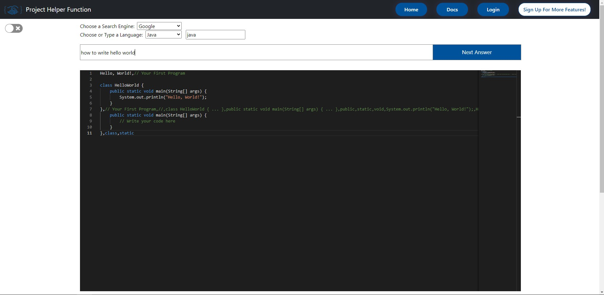
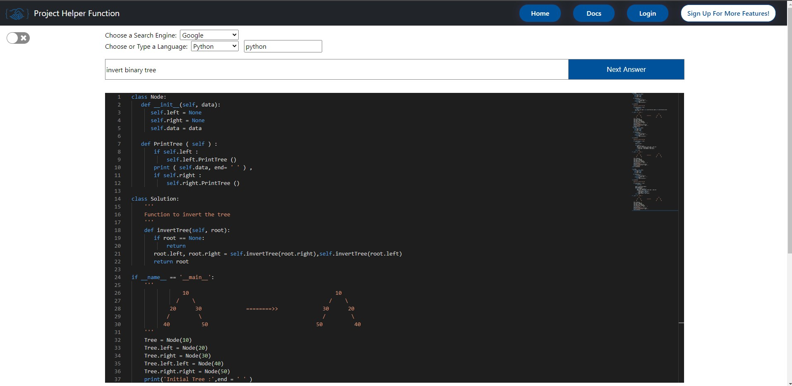
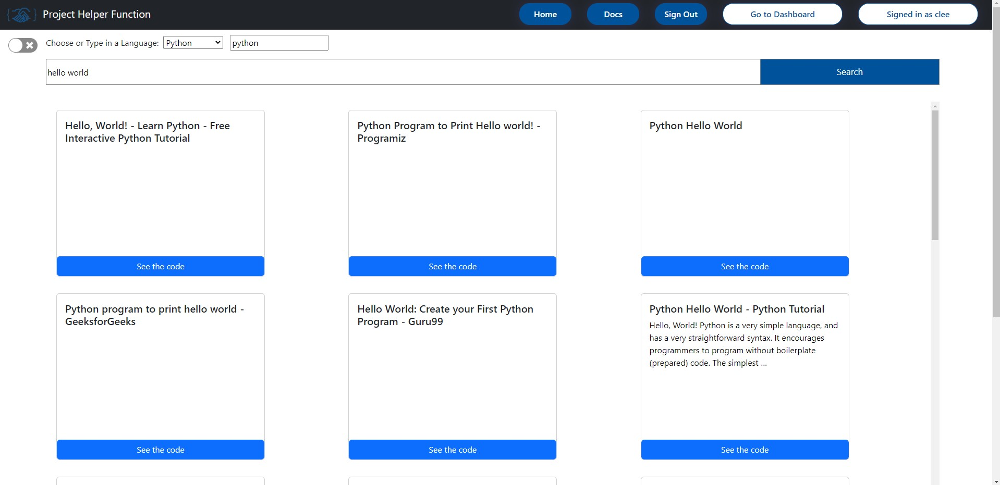
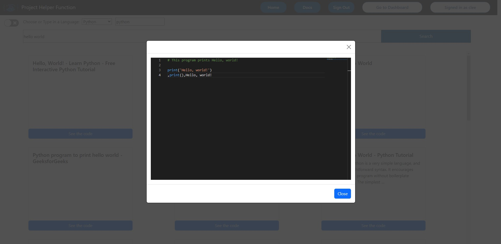

# Project-Helper-Function

Check out the project here: https://phfclient.herokuapp.com/home

Your query will produce the corresponding code snippet. See examples below. We scrape search results of your query from Google, Bing, and Yahoo. Then, we scrape the search results again, looking for the code snippet that best matches with your search query. 

Examples: 

## If you sign up: 

